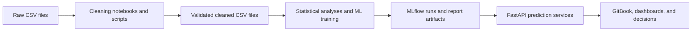

# Module 5 — Data Lineage and Metric Traceability

## Purpose

This bridge documents the evidence chain used by Modules 6–8. It does not replace a formal catalog; it identifies source files, cleaned assets, analytical outputs, API consumers, and ownership gates.

## Lineage overview



## Dataset-to-outcome matrix

| Source | Cleaned asset | Grain and coverage | Primary outcomes | Target endpoints |
|---|---|---|---|---|
| `data/orders.csv` | `orders_clean.csv` | 122,731 orders; 2021–2024 order dates | demand, delay, profitability | demand-forecast, delivery-delay, profitability |
| `data/logistics.csv` | `logistics_clean.csv` | 86,000 shipments; 2021–2024 dispatch dates | delay and route risk | delivery-delay, route-risk |
| `data/inventory.csv` | `inventory_clean.csv` | 56,000 snapshots; 2021–2024 | stock availability | stockout |
| `data/vendors.csv` | `vendors_clean.csv` | 22,080 monthly vendor records; 460 suppliers in the latest scorecard | supplier quality and risk | vendor-risk, supplier-score, procurement-cost |
| `data/financials.csv` | `financials_clean.csv` | 66,000 financial records; 2021–2024 | working capital and cash flow | working-capital, cash-flow, procurement-cost, profitability |

`financials_clean.csv` and `financials_cleaned.csv` are duplicate-shape assets in the current snapshot. One canonical name should be selected before production orchestration.

## Transformation controls

The logistics pipeline provides the strongest recorded validation trail: it removed 2,580 duplicate shipment identifiers, repaired deterministic weight/date/cost issues, and passed 25 of 25 documented validation checks. Remaining nulls are primarily conditional: active shipments without arrival dates, non-ocean port fields, and weather severity when no weather impact exists.

All downstream pipelines should apply the same control pattern:

1. Preserve immutable raw files and record hashes and ingestion timestamps.
2. Enforce primary-key uniqueness and foreign-key coverage.
3. Separate deterministic repairs from statistical imputations.
4. Version feature definitions and target windows.
5. Record train/validation/test time boundaries and prevent future leakage.
6. Link every deployed model version to its data snapshot and validation report.

## KPI definitions

| KPI | Definition | Guardrail |
|---|---|---|
| On-time delivery rate | completed shipments delivered on or before the estimated date / completed shipments | exclude in-transit records from denominator |
| Stockout rate | inventory snapshots where `stockout_flag = 1` / eligible snapshots | report by product and warehouse |
| Working capital | accounts receivable + inventory − accounts payable | reconcile to finance close |
| Profit margin | gross margin / recognized revenue | confirm post-discount basis |
| Supplier composite score | 30% delivery + 20% quality + 20% risk performance + 15% cost efficiency + 15% lead time | version weights and scaling |

## Example DAX measures

```DAX
On-Time Delivery Rate :=
DIVIDE(
    CALCULATE(COUNTROWS(Logistics), Logistics[delay_flag] = 0),
    CALCULATE(COUNTROWS(Logistics), NOT ISBLANK(Logistics[actual_arrival_date]))
)

Working Capital USD :=
SUM(Financials[accounts_receivable_usd])
    + SUM(Financials[inventory_value_usd])
    - SUM(Financials[accounts_payable_usd])

High Risk Spend Share :=
DIVIDE(
    CALCULATE(SUM(Vendors[procurement_spend_usd]), Vendors[risk_category] IN {"High", "Critical"}),
    SUM(Vendors[procurement_spend_usd])
)
```

## Ownership and release gates

| Gate | Accountable role | Evidence required |
|---|---|---|
| Source acceptance | Data owner | schema, freshness, access, retention |
| Clean-data release | Data engineering | quality checks, repair log, row reconciliation |
| Feature release | Data science | definition, leakage test, distribution baseline |
| Model release | Model risk owner | evaluation, explainability, approval, rollback version |
| API release | Platform engineering | contract tests, security, load test, observability |
