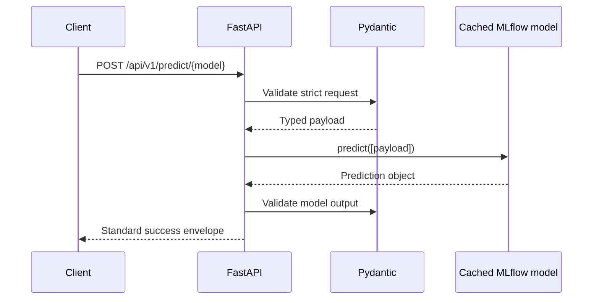

# NexaChain API Developer Handbook

## Purpose and current state

The FastAPI gateway centralizes strict request validation, cached MLflow `pyfunc` loading, response validation, sanitized errors, and request logging. Four prediction routes are currently registered. The remaining six target routes require implementation and tests.

## Local development

```powershell
python -m venv .venv
.\.venv\Scripts\Activate.ps1
pip install -r requirements.txt
$env:WORKING_CAPITAL_MODEL_URI = "runs:/<run-id>/model"
uvicorn app.main:app --reload
```

Swagger is available at `/docs`; OpenAPI JSON is available at `/openapi.json`.

## Request lifecycle



## Adding an endpoint

1. Approve the business owner, target, horizon, request fields, response fields, and decision thresholds.
2. Add strict Pydantic request and prediction schemas under `app/schemas/`; use `extra="forbid"` and finite numeric bounds.
3. Add the model name and environment variable to `SUPPORTED_MODELS` and settings.
4. Add a cached dependency getter in `app/models/loader.py`.
5. Create the route under `app/api/v1/endpoints/` and register it in the v1 router.
6. Add success, boundary, missing-field, invalid-enum, extra-field, model-unavailable, invalid-output, and parity tests.
7. Verify OpenAPI and update all Module 6 and 7 references in the same pull request.

## Error and status-code policy

| Code | Use | Client action |
|---|---|---|
| 200 | prediction accepted | consume `prediction`; retain timestamp and model version when added |
| 400 | malformed or semantically invalid request | correct the indicated field; do not retry unchanged |
| 401/403 | authentication/authorization failure after security rollout | refresh credentials or request scope |
| 404 | route not registered | confirm API version and endpoint status |
| 422 | OpenAPI/FastAPI conventional validation code; runtime is normalized to 400 in current app | treat as non-retryable input failure |
| 429 | future rate limit | retry with exponential backoff and jitter |
| 500 | unexpected service or invalid model-output error | retry only under bounded policy; alert owner |
| 503 | model unavailable or failed to load | retry with backoff or invoke fallback |

## Reliability and security

- Terminate TLS at the ingress; never expose development Uvicorn directly.
- Add OAuth 2.0 client credentials or gateway API keys, workload identity, scopes, quotas, and audit logs.
- Return a request/correlation ID and deployed model version in every response.
- Use timeouts, circuit breakers, bounded retries, and idempotent client behavior.
- Log identifiers only when permitted; redact customer and commercial data.
- Pin dependencies, scan images, run as a non-root user, and sign release artifacts.
- Define service-level objectives for availability, p95 latency, error rate, and prediction freshness.

## Testing

```powershell
python -m pytest
```

The repository tests isolate the contract layer with dependency overrides. Before production, add integration tests against packaged MLflow models, concurrency/load tests, security tests, drift checks, and smoke tests in the deployment environment.

## Model promotion

Track parameters, metrics, artifacts, code version, data snapshot, and validation status in MLflow. Promote immutable model versions through development, staging, and production aliases. Never point production to an unversioned local path. A deployment must support rollback to the last approved model and API image as one coordinated release.
