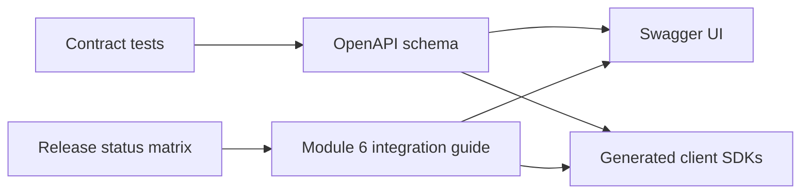

# API Documentation

## Purpose

Provide a stable navigation layer from platform concepts to the complete endpoint contracts and client integration guidance.

## Business Context

Developers and business owners need one view of what is usable today, what is designed, and what remains proposed. Status clarity prevents integration plans from depending on unavailable predictions.

## Architecture Diagram

## Workflow Explanation

Pydantic schemas and route decorators generate OpenAPI. Contract tests verify runtime behavior. Module 6 adds business meaning, examples, retry guidance, authentication requirements, and status labels. Every contract change updates code, tests, OpenAPI, examples, quick reference, and release notes together.

## Technical Notes

| Status | Endpoints |
|---|---|
| Implemented | working-capital, cash-flow, procurement-cost, profitability |
| Specified but unregistered | delivery-delay, vendor-risk, stockout, route-risk |
| Proposed | demand-forecast, supplier-score |

See the [complete integration guide](../../module-6-api/api_integration_guide.md), [quick reference](../../module-6-api/endpoint_reference.md), and [developer handbook](../../module-6-api/developer_handbook.md).

## Deliverables

- Endpoint-by-endpoint request and response reference
- Standard errors and status codes
- Client code example and retry policy
- Swagger capture runbook
- Contract maturity matrix

## Best Practices

- Generate examples from executable tests where possible.
- Keep field units, enum case, nullability, and bounds explicit.
- Document deprecation and sunset dates.
- Never publish a sample credential or confidential identifier.

## Common Challenges

| Challenge | Resolution |
|---|---|
| Documentation drifts from code | generate and diff OpenAPI in CI |
| Example values mistaken for guarantees | label them illustrative and expose uncertainty contract |
| Unregistered endpoint assumed available | show status adjacent to every endpoint |
| Clients retry invalid requests | publish status-specific retry rules |
