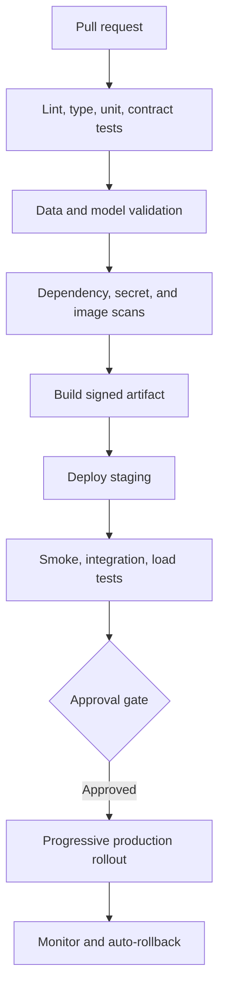

# CI/CD Workflow

## Purpose

Define automated quality, security, model, documentation, and deployment gates.

## Business Context

Prediction changes can affect purchases, cash plans, and supplier actions. Delivery automation must make unsafe changes harder to release and make approved changes easy to trace and reverse.

## Architecture Diagram

## Workflow Explanation

Pull requests run fast code and documentation checks. Model-affecting changes add data validation, backtests, cohort evaluation, and artifact-signature checks. A signed image deploys to staging for API and model smoke tests. Production promotion requires explicit approval and proceeds through canary or blue/green rollout with rollback thresholds.

## Technical Notes

- No `.github/workflows` or other CI configuration was found in the repository snapshot.
- Required checks should include Markdown links, Mermaid syntax, OpenAPI diff, pytest, dependency audit, secret scan, container scan, and model acceptance.
- Production deployment must use immutable image digests and model versions.
- Environment secrets must be referenced, never copied into workflow files.
- Documentation status tables should be validated against registered routes.

## Deliverables

- Pull-request and release workflows
- Branch protection and required-check policy
- Staging and production environment definitions
- Signed release manifest and change record
- Automated rollback and incident evidence

## Best Practices

- Separate build from deploy and promote the same artifact.
- Cache dependencies without caching secrets.
- Make tests deterministic and publish failures as actionable evidence.
- Require manual approval for material model or policy-threshold changes.

## Common Challenges

| Challenge | Resolution |
|---|---|
| Long model tests slow every PR | tier smoke, nightly, and release suites |
| Flaky time-dependent tests | freeze time and use immutable fixtures |
| Schema breaking change | run OpenAPI compatibility and consumer tests |
| Rollout passes technical checks but harms KPI | define business guardrails and canary monitoring |
