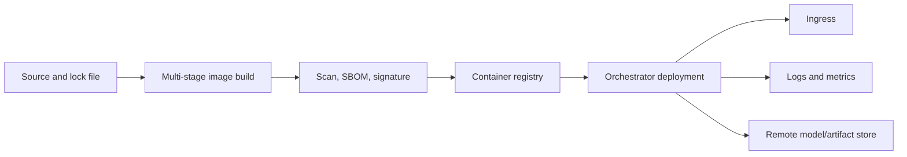

# Docker Deployment

## Purpose

Specify a secure, reproducible container pattern for the FastAPI service and its model dependencies.

## Business Context

Containerization should make the same approved API and model package portable across development, staging, and production while enabling rollback and vulnerability management.

## Architecture Diagram



## Workflow Explanation

A multi-stage build installs pinned dependencies and copies only runtime code. CI scans and signs the non-root image, then publishes an immutable digest. The orchestrator injects model URIs and credentials from secrets, executes readiness checks, and rolls out progressively. Model and image versions are recorded together.

## Technical Notes

The current repository snapshot contains no Dockerfile or Compose manifest, despite the continuity report describing container access on port 8000. The following is a target-state starting point, not a verified current artifact:

```dockerfile
FROM python:3.11-slim AS runtime
WORKDIR /app
COPY requirements.txt .
RUN pip install --no-cache-dir -r requirements.txt
COPY app ./app
RUN useradd --system --uid 10001 nexachain
USER 10001
EXPOSE 8000
CMD ["uvicorn", "app.main:app", "--host", "0.0.0.0", "--port", "8000"]
```

## Deliverables

- Pinned, multi-stage Dockerfile
- `.dockerignore`, SBOM, scan and signature evidence
- Local Compose file for non-production integration
- Orchestrator manifests and resource policies
- Image/model rollback runbook

## Best Practices

- Pin base image by digest and rebuild for security updates.
- Run as non-root with a read-only filesystem where possible.
- Keep models remote or in a separately versioned artifact layer.
- Set CPU/memory requests, limits, startup, liveness, and readiness probes.

## Common Challenges

| Challenge | Resolution |
|---|---|
| Large ML dependencies | use slim wheels, build cache, and separated model artifacts |
| Startup exceeds probe threshold | use startup probes and lazy-safe rollout design |
| Secrets embedded in image | inject from secret manager at runtime |
| Image and model rollback diverge | deploy a signed release manifest pairing both versions |
