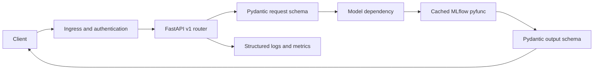

# FastAPI Architecture

## Purpose

Document the inference service boundaries, request lifecycle, schema validation, and failure behavior.

## Business Context

Enterprise consumers need stable contracts even as underlying models evolve. The API shields clients from serialization details and enforces input and output quality.

## Architecture Diagram

## Workflow Explanation

The application initializes a model manager during lifespan startup. Configured models load once and remain cached. A route validates a strict JSON body, passes a one-row dictionary list to `predict`, validates the returned object, and wraps it in a standardized timestamped envelope. Central exception handlers sanitize client errors.

## Technical Notes

- Registered routes: working capital, cash flow, procurement cost, and profitability.
- Request schemas forbid unknown fields and constrain dates, enums, ranges, and finite numbers.
- Request validation returns standardized `400`; model unavailability returns `503`; invalid model output returns `500`.
- No authentication, health/readiness route, correlation ID, rate limiting, or model-version field is implemented.
- Synchronous model calls may require worker/process sizing or a controlled thread pool under load.

## Deliverables

- Versioned OpenAPI schema
- Endpoint schemas and route modules
- Central error contract
- Contract and integration tests
- Operations runbook and service-level objectives

## Best Practices

- Keep routes thin and dependency-injected.
- Validate model output before returning it.
- Add `/health/live` and `/health/ready` with model readiness.
- Preserve backward compatibility or publish a new API version.

## Common Challenges

| Challenge | Resolution |
|---|---|
| OpenAPI advertises 422 while runtime returns 400 | customize schema or adopt one consistent policy |
| Model latency blocks workers | benchmark, size workers, batch only when appropriate |
| Model not configured | fail readiness and expose sanitized operational status |
| Contract changes silently | use schema-diff checks and consumer tests |
