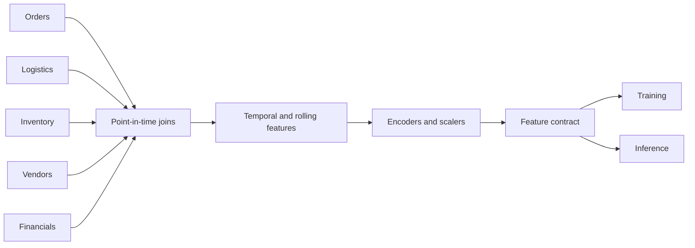

# Feature Engineering

## Purpose

Define feature families, transformation rules, leakage controls, and ownership across NexaChain use cases.

## Business Context

Supply-chain decisions depend on lagged demand, operational lead times, vendor behavior, stock positions, and financial cycles. Features must express these drivers at the correct decision time and in business-readable terms.

## Architecture Diagram

## Workflow Explanation

Features are calculated at an explicit entity and timestamp grain. Rolling measures use only observations available before prediction time. Categorical values use controlled vocabularies and unknown handling. Training statistics such as medians or scaling parameters are fitted on the training window and stored with the model.

## Technical Notes

| Use case | Representative features | Leakage guard |
|---|---|---|
| Demand | lagged units, day/week seasonality, promotion, rolling mean | exclude future orders and fulfillment outcomes |
| Delay | route, carrier history, weight, customs, mode, planned transit | exclude actual arrival and realized delay |
| Stockout | available stock, demand velocity, lead time, reorder point | exclude future receipt and stockout flag |
| Supplier risk | lagged delivery, quality, stability, concentration | use prior snapshots only |
| Finance | AR, AP, inventory, lags, fiscal seasonality | exclude post-close revisions beyond cutoff |
| Profitability | product/vendor/customer/channel and quantity | do not use realized profit for pre-sale prediction |

## Deliverables

- Feature dictionary with units, owners, and valid ranges
- Point-in-time transformation code
- Feature tests and distribution baselines
- Training/inference parity test
- Feature-set version in model metadata

## Best Practices

- Prefer interpretable ratios and lagged aggregates over opaque identifiers.
- Add missingness indicators only when absence carries business meaning.
- Cap or transform long tails only with domain evidence.
- Monitor categorical novelty and feature freshness in production.

## Common Challenges

| Challenge | Resolution |
|---|---|
| Different percentage scales | standardize to 0–1 internally and document API scale |
| Sparse categories | group only with approved, stable business taxonomy |
| Future information in snapshots | maintain `event_time` and `available_time` |
| Silent default imputation | version policies and expose missingness metrics |
