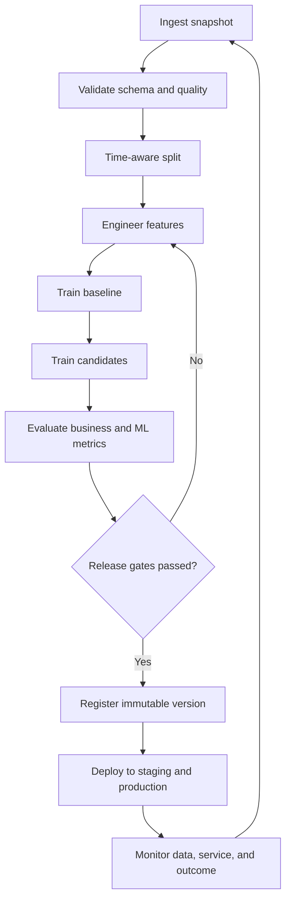

# Machine Learning Pipeline

## Purpose

Describe the repeatable path from source data to a monitored and replaceable production model.

## Business Context

Forecasts and scores must be refreshed as demand patterns, supplier performance, routes, and cash conditions change. A controlled pipeline reduces stale decisions and creates evidence for model-risk review.

## Architecture Diagram

## Workflow Explanation

Each run begins with a versioned snapshot and validation report. Temporal use cases use rolling or expanding-window backtests rather than random splits. A naive baseline is retained alongside candidates. Evaluation combines error, calibration where relevant, business cost, stability, and operational constraints. Only approved immutable versions advance through staging and production.

## Technical Notes

- Demand artifacts compare SARIMA and Prophet; SARIMA wins the recorded majority-metric rule.
- Cash-flow forecasting uses 210 history weeks and a 13-week horizon in the available report.
- Classifiers require stratified, time-aware evaluation and calibrated probabilities.
- Feature and target timestamps must be stored to enforce point-in-time correctness.
- Reproducibility requires dependency locks, seeds, code SHA, and dataset fingerprint.

## Deliverables

- Versioned training dataset manifest
- Reproducible notebook or training script
- Baseline and candidate evaluation table
- MLflow run with metrics and artifacts
- Model card, approval record, deployment manifest, and monitoring plan

## Best Practices

- Keep transformation code reusable between training and inference.
- Select metrics before training and define decision thresholds with owners.
- Evaluate by time, product, warehouse, vendor tier, region, and risk cohort.
- Run shadow or canary validation before full business activation.

## Common Challenges

| Challenge | Resolution |
|---|---|
| Temporal leakage | use event-time joins and horizon-aware cutoffs |
| Weak baseline | add seasonal naive, policy rule, or prior-period comparator |
| Metric improves but business value does not | model explicit costs and action thresholds |
| Training-serving skew | package a shared preprocessing pipeline |
