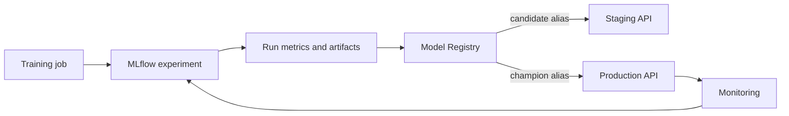

# MLflow Integration

## Purpose

Define experiment tracking, artifact management, registry promotion, and runtime model loading.

## Business Context

Traceability is essential when a forecast affects inventory, sourcing, or cash decisions. MLflow should connect each deployed response to approved code, data, parameters, metrics, and artifacts.

## Architecture Diagram

## Workflow Explanation

Training creates a named experiment and run, logs data/code identifiers, parameters, metrics, forecasts, plots, and the packaged pipeline. An approval process creates an immutable model version and assigns an environment alias. The FastAPI model manager loads configured URIs once during startup and caches models for request reuse.

## Technical Notes

- The repository contains a file-based experiment named `module5_demand_forecasting` with four finished SARIMA/Prophet runs.
- Available metrics include MAE, RMSE, and MAPE; forecast CSV artifacts are present.
- The SQLite file contains no tracking tables, and no registered-model metadata was found in the snapshot.
- Current configuration accepts endpoint-specific URI environment variables or `MODEL_URIS_JSON`.
- Production should use a remote backend/artifact store, access controls, retention policy, and immutable versions.

## Deliverables

- Experiment naming and tagging convention
- Logged dataset fingerprint and code SHA
- Model signature and input example
- Registry approval record and aliases
- Deployment-to-model mapping and rollback runbook

## Best Practices

- Log metrics with units and evaluation windows.
- Log the full preprocessing-plus-model pipeline.
- Require model signatures and schema compatibility checks.
- Never store credentials in run parameters or artifact URIs.

## Common Challenges

| Challenge | Resolution |
|---|---|
| File store cannot support team governance | migrate to managed/remote tracking and artifacts |
| Registry alias drifts from deployed image | record both in release metadata and verify at startup |
| Missing dataset identity | log content hash, time range, row count, and schema version |
| Model load fails | fail readiness, retain last approved version, alert owner |
