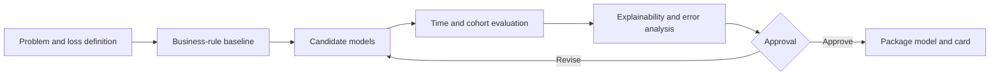

# Model Development

## Purpose

Explain how candidate models are selected, evaluated, interpreted, and approved.

## Business Context

NexaChain uses both forecasting and scoring problems. The most complex algorithm is not automatically the best choice; the winning model must improve the relevant decision while remaining reliable and operable.

## Architecture Diagram

## Workflow Explanation

The team defines prediction time, target, horizon, action, and cost of errors before model selection. Candidates are compared against a simple baseline using held-out periods. Error analysis identifies cohorts where the model is unsafe or unhelpful. Explainability checks whether drivers are plausible, while model cards capture intended use and limitations.

## Technical Notes

- Recorded demand evaluation: SARIMA MAE 2,831.61, RMSE 21,849.37, MAPE 19.01%; Prophet MAE 2,859.00, RMSE 21,840.65, MAPE 20.34%.
- The demand series includes an influential December 31, 2024 point; excluding it materially lowers error, so both views must remain visible.
- Recorded 13-week cash-flow forecast: MAE $14.1M, RMSE $18.3M, MAPE 36.1%; this supports scenario planning, not precise cash commitments.
- Threshold models should report calibration, precision/recall, expected cost, and decision-curve performance.
- No repository-backed SHAP artifacts were found; explainability remains a release gate.

## Deliverables

- Problem statement and acceptance criteria
- Candidate comparison and error analysis
- Explainability package and model card
- Approved serialized pipeline
- Rollback and monitoring thresholds

## Best Practices

- Report uncertainty intervals, not point estimates alone.
- Evaluate stability across time and operational cohorts.
- Use human review for high-impact supplier and liquidity decisions.
- Separate model score from policy threshold so policy can be governed independently.

## Common Challenges

| Challenge | Resolution |
|---|---|
| Optimizing one aggregate metric | use a balanced metric set and cohort gates |
| Outlier-dominated forecasts | publish sensitivity views and investigate root cause |
| Explanations mistaken for causality | label SHAP as model attribution, not causal effect |
| Unclear model ownership | assign business, data science, and platform approvers |
