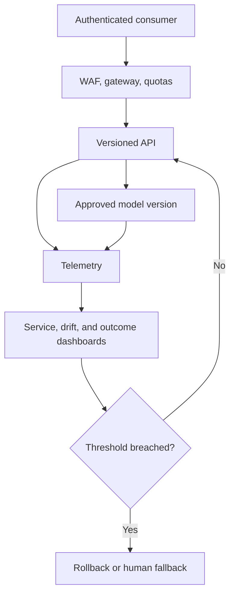

# Production Guidelines

## Purpose

Set the minimum governance, security, reliability, observability, and operational standards for production use.

## Business Context

NexaChain predictions influence working capital, service levels, sourcing, and pricing. Production readiness requires controlled decisions and measurable business outcomes, not only a functioning endpoint.

## Architecture Diagram

## Workflow Explanation

An authenticated request passes gateway policy and the versioned API. The response identifies the approved model and correlation context. Telemetry measures service behavior, input/output distributions, and realized outcomes. Alert thresholds trigger investigation, traffic reduction, rollback, or a documented manual fallback.

## Technical Notes

- Define p95/p99 latency, availability, error budget, and freshness SLOs by endpoint.
- Monitor input validity, missingness, categorical novelty, drift, prediction distribution, calibration, and business outcome delay.
- Retain audit metadata without logging unnecessary personal or commercial details.
- Complete privacy, security, model-risk, and business-owner approvals before activation.
- High-impact supplier and liquidity actions should remain human-reviewed until performance is proven.

## Deliverables

- Threat model and data-protection assessment
- SLOs, dashboards, alerts, and on-call ownership
- Model card, change record, approval, and rollback plan
- Incident response and business continuity runbooks
- Periodic performance and fairness review

## Best Practices

- Default to least privilege and encrypted transport/storage.
- Use progressive delivery and automated rollback guardrails.
- Separate prediction from irreversible business action.
- Revalidate models on a fixed cadence and after material drift or policy change.

## Common Challenges

| Challenge | Resolution |
|---|---|
| Outcome labels arrive late | monitor leading drift signals and backfill outcome evaluation |
| Alert fatigue | tie alerts to actionable thresholds and owners |
| Model is healthy but service is not | separate model, API, infrastructure, and business telemetry |
| Emergency rollback loses traceability | use preapproved immutable fallback versions and record activation |
