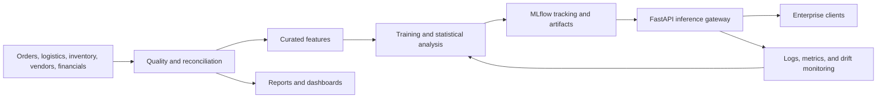

# Project Architecture

## Purpose

Define the system boundaries, major components, and evidence flow for the NexaChain Intelligence Platform.

## Business Context

NexaChain combines demand, logistics, inventory, supplier, and finance signals to support replenishment, sourcing, treasury, pricing, and delivery decisions. The platform must provide decision support without hiding uncertainty or model maturity.

## Architecture Diagram

## Workflow Explanation

Raw CSV assets are profiled and repaired into curated datasets. Analytical notebooks and scripts create hypotheses, forecasts, and scorecards. MLflow records available demand-forecast experiments. Approved model packages are loaded once during FastAPI startup and served through strict request and response schemas. Reports and operational telemetry close the feedback loop.

## Technical Notes

- The canonical API prefix is `/api/v1`.
- Four routes are implemented; six target routes remain unregistered.
- Data coverage is primarily January 2021 through December 2024.
- The current deployment is file/workstation oriented; orchestration, secrets, registry promotion, and production observability remain target-state capabilities.
- Architecture decisions should be recorded as versioned ADRs.

## Deliverables

- Cleaned datasets and quality reports
- Statistical and forecasting reports
- MLflow experiment artifacts
- FastAPI application and tests
- Modules 5–8 documentation set

## Best Practices

- Treat data, features, model, API, and documentation as one versioned release unit.
- Enforce domain ownership and explicit data contracts.
- Keep business rules separate from model inference code.
- Design for rollback, auditability, and least privilege from the start.

## Common Challenges

| Challenge | Resolution |
|---|---|
| Inconsistent claims about endpoint readiness | derive status from registered code and tests |
| Duplicate curated finance filenames | select one canonical asset and deprecate the other |
| Cross-domain identifiers drift | publish conformed dimensions and foreign-key checks |
| Prototype components presented as production | use maturity labels and release gates |
