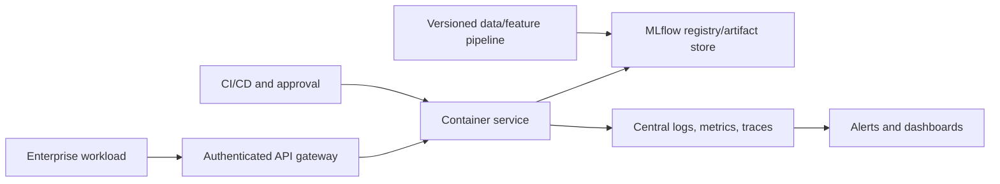

# NexaChain Technical Appendix

## A. Evidence inventory

| Evidence | Location | Use |
|---|---|---|
| Curated domain files | `data/cleaned/` | dataset counts, fields, date coverage |
| Logistics quality package | `Reports/logistics_data_quality/` | repair counts, validations, caveats |
| Supplier scorecard package | `Reports/module2_supplier_performance/` | portfolio score, trend, risk/spend exposure |
| Treasury analysis | `Reports/module4_treasury_cash_flow/` | stress and seasonality evidence |
| Demand forecasts | `Reports/module5_demand_forecasting/` | SARIMA/Prophet comparison |
| Cash-flow forecasts | `Reports/module6_cash_flow_forecasting/` | 13-week forecast and errors |
| Vendor quality test | `Reports/h2_vendor_quality/` | tier defect comparison |
| Pricing hypothesis | `Reports/h3_discount_profitability/` | discount coverage and correlation |
| FastAPI code and tests | `app/` | implemented runtime behavior |
| Continuity report | `Reports/Continuity Api Endpoint.md` | specified target contracts |
| MLflow file store | `Models/mlruns/` | demand experiment runs and artifacts |

## B. Dataset caveats

- Coverage is a repository snapshot, not a live or SLA-backed feed.
- Null cells include legitimate conditional absence and require field-specific rules.
- Finance has two same-shape curated filenames; canonical status is unresolved.
- Carrier and route master data were not supplied for the logistics validation.
- Source route identifiers use five digits after `RTE-`, while an older PDF reportedly expected six.
- No records support the requested >30% discount segment.

## C. Metric definitions

| Metric | Definition |
|---|---|
| MAE | mean absolute difference between actual and forecast, in target units |
| RMSE | square root of mean squared error; weights large errors more heavily |
| MAPE | mean absolute percentage error; unstable near zero actuals |
| Prediction-interval coverage | share of actuals inside forecast lower/upper bounds |
| Supplier dynamic score | six-month exponentially weighted score with three-month half-life |
| Supplier trend | recent three-month mean minus prior three-month mean; improving ≥ +2, deteriorating ≤ −2 |
| Stress week | follow the saved treasury report’s eligibility and threshold definition; formal catalog entry required |

## D. Supplier composite formula

```text
score = 0.30 × on_time_delivery
      + 0.20 × quality
      + 0.20 × risk_performance
      + 0.15 × cost_efficiency
      + 0.15 × lead_time
```

All components must use the same 0–100 direction where higher is better. Risk inputs must be inverted or transformed explicitly before use.

## E. API implementation evidence

Implemented routes load configured MLflow `pyfunc` models once during FastAPI lifespan startup. Request bodies are strict and extra fields are forbidden. The route calls `model.predict([payload])`; response models validate the returned object. Central handlers map request validation to 400, unavailable models to 503, invalid model output to 500, and unexpected errors to sanitized 500 responses.

Environment variables currently supported:

```text
WORKING_CAPITAL_MODEL_URI
CASH_FLOW_MODEL_URI
PROCUREMENT_COST_MODEL_URI
PROFITABILITY_MODEL_URI
MODEL_URIS_JSON
```

## F. Target production topology



## G. Validation checklist

- Data schema, row reconciliation, key uniqueness, freshness, and leakage checks
- Temporal backtest and cohort evaluation against a baseline
- Uncertainty/calibration and business-cost evaluation
- SHAP/model-card review and prohibited-feature assessment
- Model signature and training-serving parity
- API contract, integration, load, security, and failure tests
- Image scan, SBOM, signature, secrets, and least privilege
- Staging smoke test, canary guardrails, rollback drill, and outcome monitoring

## H. Report quality mapping

The executive report contract is implemented as: title; visible Executive Summary; evidence-bearing Sections 4–15; recommendations in Section 16; future questions/enhancements in Section 17; and caveats adjacent to relevant evidence plus this appendix. Quantitative visuals were not generated because the requested primary delivery is a GitBook-ready Markdown documentation set and the repository already contains chart artifacts; the supporting-visualization register specifies the figures required for publication.
